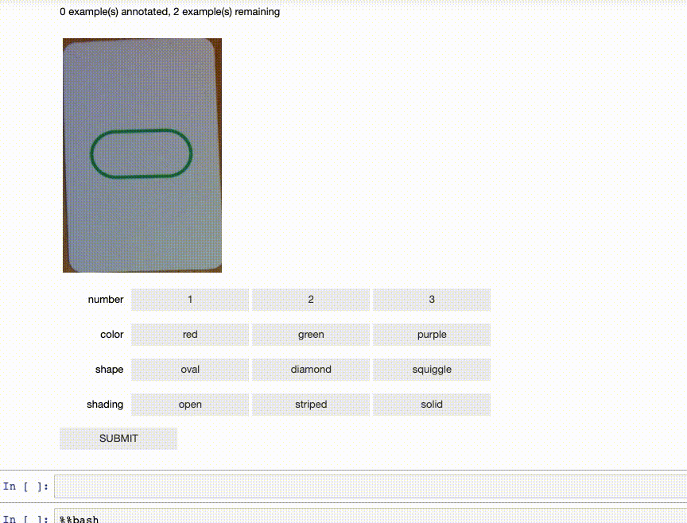
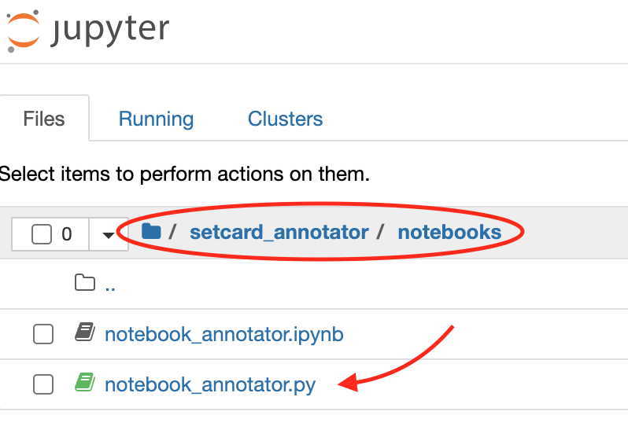

# setcard_annotator
A simple tool for annotating Set cards images from a Jupyter notebook.



## Set the environment
From the root directory of this project do:
```bash
pipenv install
pipenv shell
```

## Run the tests 
```bash
python -m unittest discover -v
```

## Run the annotator notebook
```bash
jupyter notebook
```

In Jupyter notebook navigate to `setcard_annotator/notebooks` and start `notebook_annotator` notebook:  


